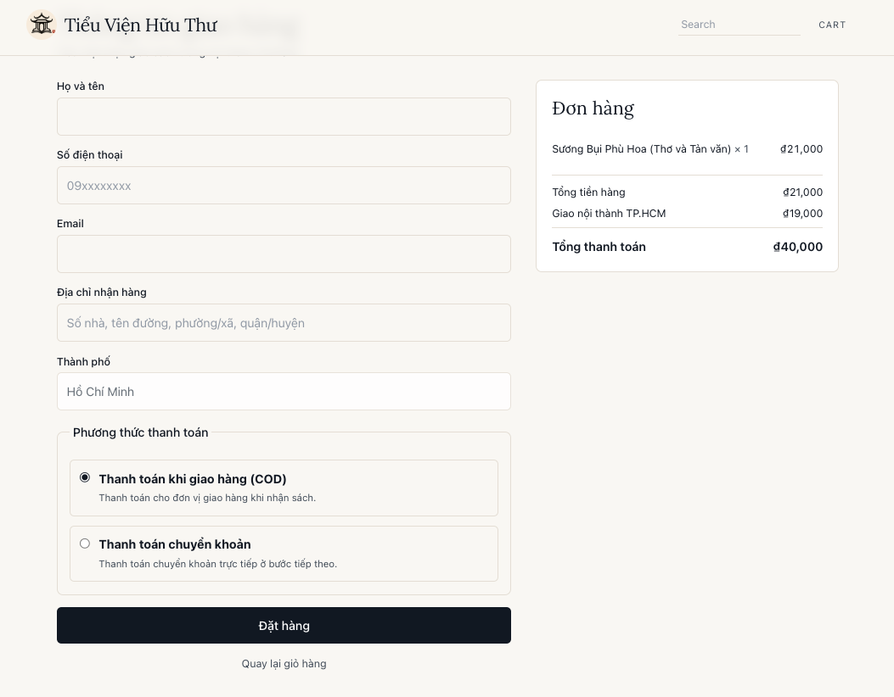
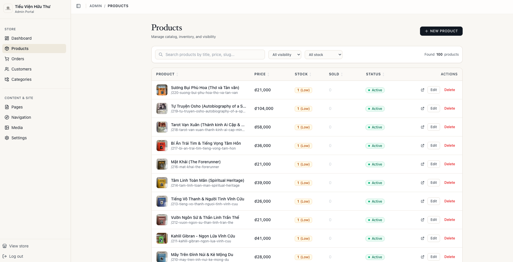
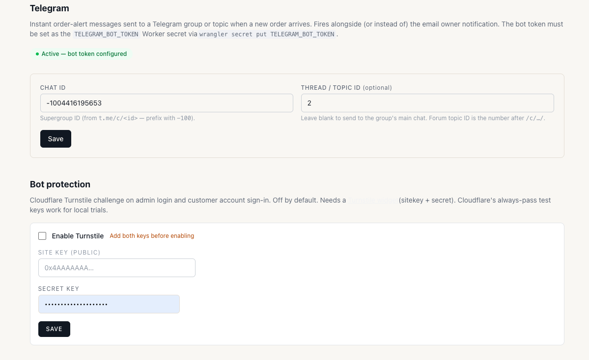
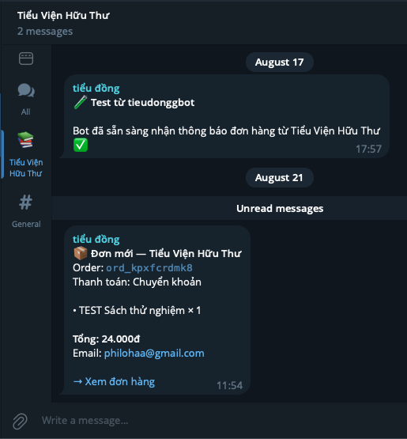

# 📚 Tiểu Viện Hữu Thư — Bookstore

Hệ thống cửa hàng sách trực tuyến hiện đại, tối giản và tối ưu hiệu năng. Được xây dựng trên nền tảng **Astro (SSR)** kết hợp **Cloudflare Workers (D1, R2, KV)** và giao diện quản trị **shadcn/ui**.

---

## 📸 Screenshots & Preview

| **Storefront (Catalog & Search)** | **Checkout & Payment Flow** |
| :---: | :---: |
|  |  |
| *Modern, responsive catalog with full-text search* | *Frictionless checkout supporting COD & Bank Transfer* |
| **Admin Management Portal** | **Telegram Bot & Turnstile Settings** |
|  |  |
| *Comprehensive book, stock & order management* | *Cloudflare Turnstile CAPTCHA & Telegram Bot configuration* |
| **Telegram Order Notifications** | **Real-Time Alert Features** |
|  | • **Instant Alerts**: Real-time push notification for every new order<br>• **Order Breakdown**: Total price, items, quantity & customer email<br>• **Direct Action Link**: One-click jump to order details in Admin<br>• **Topic Support**: Flexible routing to Telegram supergroups & forum topics |

---

## ✨ Tính năng nổi bật

- **⚡ Trải nghiệm đọc & mua sách mượt mà**: Server-rendered (SSR), tải trang tức thì, hỗ trợ responsive hoàn hảo trên mọi thiết bị.
- **🏷️ Danh mục & Tìm kiếm thông minh**: Phân loại theo nhiều danh mục (Kinh doanh, Khoa học, Tâm lý, Triết học...), sắp xếp theo giá / tên / mới nhất, tìm kiếm Full-Text (FTS5).
- **🛒 Giỏ hàng & Thanh toán linh hoạt**: Giỏ hàng lưu trữ an toàn, hỗ trợ đặt hàng COD và Chuyển khoản ngân hàng trực tiếp.
- **📦 Quản lý kho hàng & Sản phẩm**: Quản lý chi tiết đầu sách, số lượng tồn kho (Stock/Low/Sold), giá bán, hình ảnh và trạng thái ẩn/hiện.
- **📑 Trang nội dung (Markdown Pages)**: Viết và xuất bản các trang giới thiệu, chính sách giao hàng, điều khoản dịch vụ bằng Markdown với Live Preview.
- **🔔 Thông báo đa kênh**: Tích hợp thông báo đơn hàng mới qua **Telegram** và **Email**.
- **🛡️ Bảo mật cao cấp**: Giao diện Admin được bảo vệ bằng PBKDF2 hash / Cloudflare Access, chống brute-force qua Cloudflare Turnstile và Rate Limiting.

---

## 🛠️ Công nghệ sử dụng (Tech Stack)

| Thành phần | Công nghệ |
|---|---|
| **Frontend & Framework** | [Astro](https://astro.build) (SSR) + [React](https://react.dev) |
| **UI Components & Styling** | [shadcn/ui](https://ui.shadcn.com), [Tailwind CSS v4](https://tailwindcss.com), [Lucide React](https://lucide.dev) |
| **Edge Compute** | [Cloudflare Workers](https://workers.cloudflare.com/) |
| **Cơ sở dữ liệu** | [Cloudflare D1](https://developers.cloudflare.com/d1/) (SQLite trên Edge) |
| **Lưu trữ tệp & Media** | [Cloudflare R2](https://developers.cloudflare.com/r2/) |
| **Thông báo & Tích hợp** | Telegram Bot API, Resend, Cloudflare Turnstile |

---

## 🚀 Hướng dẫn cài đặt & Chạy cục bộ

### Yêu cầu
- **Node.js**: ≥ 22.12
- **npm** hoặc **pnpm**

### Các bước cài đặt

1. **Clone repository và cài đặt dependencies:**
   ```bash
   git clone <repo-url>
   cd bookstore
   npm install
   ```

2. **Khởi tạo dữ liệu cục bộ (D1 migrations & seed data):**
   ```bash
   npm run provision:local -- --seed
   ```

3. **Khởi chạy môi trường phát triển (Dev Server):**
   ```bash
   npm run dev
   ```

4. **Truy cập ứng dụng:**
   - **Storefront**: [http://localhost:4321](http://localhost:4321)
   - **Admin Portal**: [http://localhost:4321/admin](http://localhost:4321/admin)

---

## 📋 Các lệnh quản trị & Scripts thông dụng

| Lệnh | Chức năng |
|---|---|
| `npm run dev` | Chạy dev server cục bộ |
| `npm run build` | Build ứng dụng cho môi trường production |
| `npm run preview` | Chạy thử bản build với Wrangler cục bộ |
| `npm run test` | Chạy bộ kiểm thử (Vitest) |
| `npm run db:migrate` | Áp dụng database migrations vào D1 cục bộ |
| `npm run db:migrate:remote` | Áp dụng database migrations vào Cloudflare D1 production |
| `npm run admin:reset` | Reset mật khẩu quản trị Admin trên môi trường local |
| `npm run admin:reset:remote` | Reset mật khẩu quản trị Admin trên môi trường remote |
| `npm run deploy` | Triển khai ứng dụng lên Cloudflare Workers |

---

## 📄 Bản quyền

Dự án được phát hành dưới giấy phép [MIT](LICENSE).
