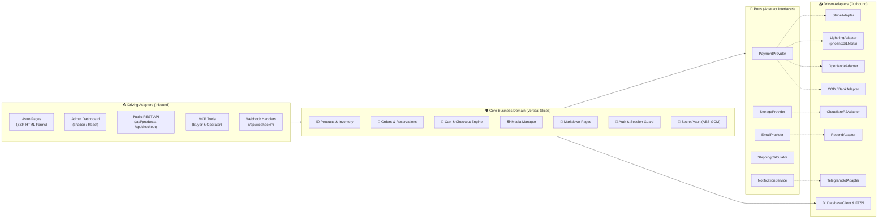
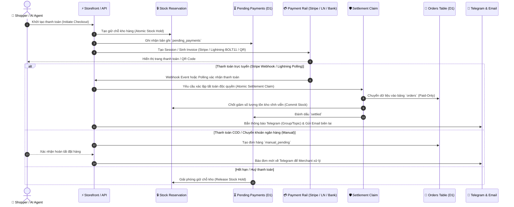
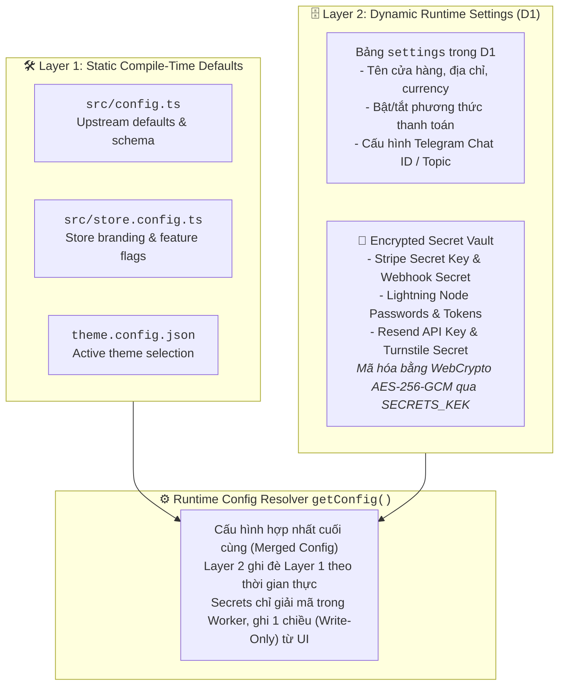
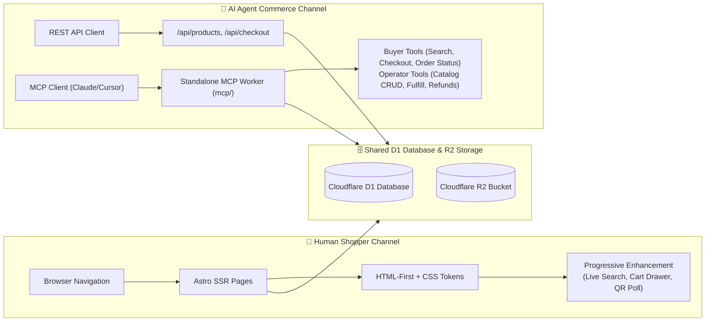
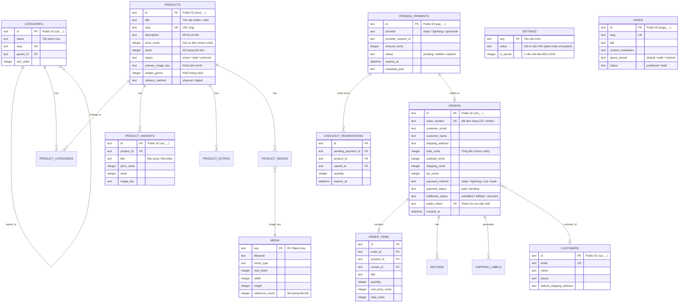

# System Overview & Architecture

## 1. Executive Summary & Design Philosophy

**Tiểu Viện Hữu Thư (bookstore)** là nền tảng thương mại điện tử hiện đại, tối giản và hiệu năng cao, được thiết kế chạy 100% trên hạ tầng serverless tại biên (**Cloudflare Edge Network**).

### Triết lý kiến trúc cốt lõi:
- **Serverless & Zero-Cold-Start:** Vận hành hoàn toàn trên Cloudflare Workers, Cloudflare D1 (SQLite phân tán) và Cloudflare R2 (Object Storage không phí egress).
- **HTML-First & Near-Zero JS:** Render phía máy chủ (SSR) qua Astro, ưu tiên Progressive Enhancement cho trải nghiệm người dùng tức thì.
- **Ports & Adapters (Hexagonal Architecture):** Tách biệt logic nghiệp vụ khỏi các dịch vụ bên ngoài (thanh toán, lưu trữ, email, thông báo).
- **Agent-Ready & Dual Interface:** Sẵn sàng phục vụ đồng thời cả người dùng duyệt web lẫn các AI Agent tự hành thông qua Public REST API và Standalone Model Context Protocol (MCP) Worker.
- **Fail-Closed Security & Secret Vault:** Bảo vệ nghiêm ngặt khu vực Admin và mã hóa toàn bộ API keys/secrets của bên thứ ba bằng WebCrypto AES-GCM.

---

## 2. Technology Stack

| Tầng (Layer) | Công nghệ | Chi tiết vai trò |
|---|---|---|
| **Runtime & Hosting** | Cloudflare Workers | Edge serverless runtime thông qua `@astrojs/cloudflare` |
| **Framework** | Astro 5/7 (SSR mode) | Server-side rendering, component-driven UI |
| **Admin UI & Islands** | React 19 + shadcn/ui | Giao diện quản trị, Tailwind CSS v4, Lucide Icons |
| **Database** | Cloudflare D1 | SQLite phân tán tại Edge, tích hợp FTS5 Full-Text Search |
| **Media & Assets** | Cloudflare R2 | S3-compatible private bucket cho ảnh sản phẩm & tệp số |
| **Payment Rails** | Stripe, Lightning, OpenNode, COD, Bank | Cổng thanh toán đa dạng theo mô hình Ports & Adapters |
| **Notifications** | Telegram Bot API, Resend, Cloudflare Email | Thông báo đơn hàng tức thì cho merchant & khách hàng |
| **Agent / MCP** | Model Context Protocol (`@modelcontextprotocol/sdk`) | Worker MCP độc lập phục vụ AI Buyer & AI Operator |
| **Testing & Quality** | Vitest + TypeScript Strict | Unit tests, contract tests và verification suite |

---

## 3. High-Level System Architecture

Sơ đồ tổng quan luồng dữ liệu và hạ tầng biên giữa người dùng, AI Agent, Cloudflare Edge và các dịch vụ bên thứ ba:

```mermaid
flowchart TB
    subgraph Clients[" 👥 Clients & Consumers "]
        Shopper["🌐 Human Shopper<br/>(Browser / Mobile)"]
        AgentBuyer["🤖 AI Agent (Buyer)<br/>(Autonomous Purchase)"]
        Merchant["🧑‍💼 Merchant / Admin<br/>(Browser Portal)"]
        AgentOp["🤖 AI Agent (Operator)<br/>(Store Management)"]
    end

    subgraph CFEdge[" ☁️ Cloudflare Edge Network "]
        EdgeRouting["Cloudflare CDN / WAF / Turnstile"]
        
        subgraph ComputeLayer[" Compute Layer (Cloudflare Workers) "]
            AstroApp["⚡ Astro SSR Worker<br/><code>bookstore</code><br/>- Storefront SSR (HTML/CSS)<br/>- Admin Portal (React / shadcn)<br/>- Public Agent REST API (/api/*)<br/>- Webhook Ingestion (/api/webhook/*)"]
            MCPWorker["🧠 Standalone MCP Worker<br/><code>bookstore-mcp</code><br/>- Buyer Tier (Public Tools)<br/>- Operator Tier (Bearer Auth)"]
        end

        subgraph DataLayer[" Storage & Data Layer "]
            D1[("🗄️ Cloudflare D1<br/>(Distributed SQLite + FTS5)<br/>- Products, Orders, Categories<br/>- Encrypted Secret Vault")]
            R2[("📦 Cloudflare R2 Bucket<br/>(Zero-Egress Object Storage)<br/>- Product Images<br/>- Digital Deliverables")]
        end
    end

    subgraph ExternalServices[" 🔌 External Services & Third Parties "]
        Stripe["💳 Stripe Checkout & Webhooks"]
        Lightning["⚡ Bitcoin Lightning<br/>(phoenixd / LNbits / OpenNode)"]
        Telegram["💬 Telegram Bot API<br/>(Order Alerts to Group/Topic)"]
        Email["✉️ Resend / Cloudflare Email<br/>(Transactional Receipts)"]
    end

    %% Client Interactions
    Shopper -->|HTTPS GET/POST| EdgeRouting
    Merchant -->|HTTPS /admin (Protected)| EdgeRouting
    AgentBuyer -->|REST API /api/products, /api/checkout| EdgeRouting
    AgentBuyer -->|JSON-RPC / SSE| MCPWorker
    AgentOp -->|JSON-RPC + Bearer Token| MCPWorker

    %% Edge Routing to Worker
    EdgeRouting --> AstroApp

    %% Workers to Data Layer
    AstroApp -->|D1 Binding (Queries & Tx)| D1
    AstroApp -->|R2 Binding (Images & Files)| R2
    MCPWorker -->|D1 Binding (Direct SQL)| D1
    MCPWorker -->|R2 Binding| R2

    %% Astro App to External Services
    AstroApp -->|Redirect / Webhooks| Stripe
    AstroApp -->|Invoices / Poll| Lightning
    AstroApp -->|Send Notifications| Telegram
    AstroApp -->|Send Confirmation| Email
```

---

## 4. Modular Hexagonal Architecture (Ports & Adapters)

Mã nguồn được tổ chức theo kiến trúc Hexagonal (Ports & Adapters) bên trong `src/features/`. Core business logic hoàn toàn độc lập với SDK của các nhà cung cấp bên ngoài:



---

## 5. Order, Payment & Settlement Lifecycle

Quy trình xử lý đơn hàng từ lúc đặt hàng đến khi tất toán và gửi thông báo, bảo đảm tính bất biến **Paid-Only Invariant** (bảng `orders` chỉ chứa các đơn hàng đã thanh toán thành công):



---

## 6. Dual-Layer Configuration & Secret Vault

Hệ thống kết hợp 2 tầng cấu hình để đảm bảo an toàn, bảo mật và linh hoạt khi triển khai:



---

## 7. AI Agent & Human Dual Interface

Hệ thống hỗ trợ song song 2 đối tượng người dùng qua 2 kiến trúc tối ưu riêng biệt:



---

## 8. Database Architecture & Entity Relationship Diagram (ERD)

Sơ đồ cấu trúc thực thể và quan hệ trong cơ sở dữ liệu SQLite (Cloudflare D1):



---

## 9. Directory Layout & Feature Slices

Toàn bộ mã nguồn áp dụng mô hình phân chia theo tính năng (**Vertical Feature Slices**), giúp mỗi module tự đóng gói query, kiểu dữ liệu và UI:

```
src/
├── config.ts              # Upstream config schema, defaults & types
├── store.config.ts        # Customization overrides (branding, links)
├── middleware.ts          # Fail-closed authentication & bot protection gate
├── env.d.ts               # Cloudflare Bindings (D1, R2, SECRETS_KEK)
├── layouts/               # Layout.astro (Storefront), AdminLayout.astro
├── pages/                 # Astro Route Handlers (SSR)
│   ├── index.astro        # Trang chủ cửa hàng
│   ├── products/          # Chi tiết sản phẩm & tìm kiếm
│   ├── categories/        # Trang danh mục sách
│   ├── cart.astro         # Giỏ hàng
│   ├── checkout.astro     # Trang đặt hàng & thanh toán
│   ├── pay/               # Trang hiển thị Lightning invoice & QR polling
│   ├── order/             # Trang xác nhận đơn & tải file kỹ thuật số
│   ├── pages/             # Hiển thị Markdown pages
│   ├── admin/             # Dashboard quản trị (shadcn/ui + React)
│   ├── api/               # REST APIs & Webhooks
│   └── images/            # R2 private image proxy
└── features/              # Feature Vertical Slices
    ├── auth/              # PBKDF2 hashing, session cookies, Turnstile
    ├── cart/              # HttpOnly cookie-based cart state
    ├── catalog/           # Public JSON serialization cho Agent
    ├── categories/        # Danh mục phân cấp
    ├── customers/         # Quản lý khách hàng & địa chỉ
    ├── digitalDelivery/   # Tệp số & secure download tokens
    ├── email/             # EmailProvider (Resend / CF Email)
    ├── media/             # Quản lý tệp R2 & reference counting
    ├── navigation/        # Menu điều hướng động
    ├── orders/            # Đơn hàng, atomic stock reservation & settlement
    ├── pages/             # Quản trị trang Markdown tĩnh
    ├── payments/          # PaymentProvider & adapters (Stripe, LN, OpenNode, COD, Bank)
    ├── products/          # Quản lý sản phẩm, variants, extras, FTS5 search
    ├── refunds/           # Xử lý hoàn tiền
    ├── search/            # D1 FTS5 full-text search
    ├── secrets/           # AES-256-GCM Secret Vault
    ├── settings/          # Cấu hình runtime D1
    ├── shipping/          # Tính phí vận chuyển & in vận đơn
    ├── storage/           # StorageProvider & R2 Adapter
    ├── storefront/        # Theme tokens & Layout contracts
    └── telegram/          # Telegram Bot API client & alerts
```

---

## 10. Architectural Invariants (Quy tắc bất biến)

1. **Near-Zero Client JS:** Giao diện Storefront hoàn toàn render từ Server (SSR), không tải các framework JS nặng nề ở client. Sử dụng form chuẩn HTML và Web components / Progressive Enhancement khi cần tương tác.
2. **Paid-Only Orders Invariant:** Bảng `orders` **chỉ** lưu trữ các giao dịch đã thanh toán hoặc đã xác nhận thành công. Các thanh toán đang chờ xử lý được giữ trong `pending_payments`.
3. **Dual-Layer Configuration:** Thiết lập runtime vận hành nằm trong D1 (`settings`), còn cấu hình tĩnh và giá trị mặc định nằm trong `config.ts` / `store.config.ts`.
4. **Ports & Adapters Core:** Toàn bộ logic lõi chỉ phụ thuộc vào Interface trừu tượng (`PaymentProvider`, `StorageProvider`, `EmailProvider`).
5. **Fail-Closed Admin:** Khi chạy production, nếu thiếu cấu hình hoặc credentials, hệ thống sẽ tự động khóa `/admin` thay vì mở công khai.
6. **Additive Migrations Only:** Các file migration trong `migrations/` luôn tuân thủ nguyên tắc tăng dần (`CREATE TABLE IF NOT EXISTS`, `ALTER TABLE ADD COLUMN`) và không bao giờ sửa đổi file migration cũ đã chạy.
7. **Minor Units for Money:** Toàn bộ giá tiền, thuế, phí vận chuyển được lưu trữ và tính toán bằng đơn vị nhỏ nhất (cents, satoshis, VND) dưới dạng số nguyên (`integer`) để loại bỏ sai số dấu phẩy động.
8. **Media Single Ownership:** Toàn bộ thao tác tải lên, xóa và quản lý tệp trên Cloudflare R2 được quản lý tập trung thông qua `features/media`. Các thực thể khác chỉ lưu trữ `image_key`.
